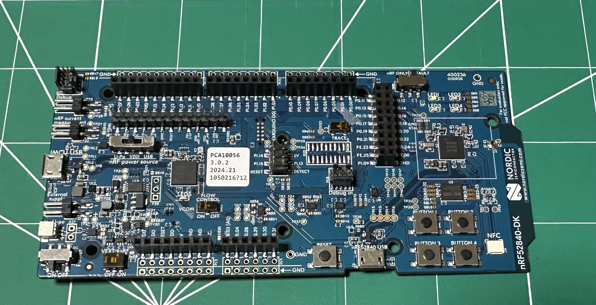

# nRF52840-DK Blinky

**Blinky** is a simple program that blinks an LED forever using the GPIO API.



## Overview

This program demonstrates:

1. Retrieving a pin specification from the device tree as a `gpio_dt_spec`.
2. Configuring the GPIO pin as an output.
3. Toggling the pin in a continuous loop.

## Requirements

To run this program, your board must:

1. Have an LED connected via a GPIO pin (commonly referred to as "User LEDs" on many boards).
2. Have the LED configured using the `led0` alias in the device tree.

## Building and Running

Build and flash the program with the following commands, replacing `reel_board` with the name of your board:

```bash
west build -b reel_board samples/basic/blinky
west flash
```
After flashing, the LED will blink continuously, and messages with the current LED state will be printed on the console. If a runtime error occurs, the program will exit without further output.

## Troubleshooting Build Errors

You may encounter a build error when defining the `struct gpio_dt_spec led` variable if the board does not support this sample. For example, GCC-based toolchains may produce an error like:

```text
error: '__device_dts_ord_DT_N_ALIAS_led_P_gpios_IDX_0_PH_ORD' undeclared here (not in a function)
```
## Adding Support for Your Board

To add support for a board, modify its device tree as follows:
```
/ {
	aliases {
		led0 = &myled0;
	};

	leds {
		compatible = "gpio-leds";
		myled0: led_0 {
			gpios = <&gpio0 13 GPIO_ACTIVE_LOW>;
		};
	};
};
```
This configuration sets the led0 alias to use pin 13 on GPIO controller gpio0. The GPIO_ACTIVE_HIGH flag means the LED is on when the pin is set high and off when set low.

## Notes:

- If the LED is built into the board hardware, the led0 alias should already be defined in the board’s default device tree file.
- For custom LEDs, define the alias in a device tree overlay file.
